<div align="center">

# ⚡ Impact Log

**Professional Career Growth Tracker**

[](https://impact-log-skm.web.app)
[](https://www.typescriptlang.org/)
[](https://reactjs.org/)
[](https://firebase.google.com/)

*Transform how you document and communicate your career value using the proven CAR methodology.*

[Architecture](#-architecture) • [Features](#-features) • [Deployment](#-deployment) • [Getting Started](#-getting-started)

</div>

---

## 🎯 What is Impact Log?

Impact Log helps professionals **track, organize, and communicate their career achievements** effectively. Built for performance reviews, 1:1s, and resume updates, it structures your wins using the **CAR methodology** (Challenge, Action, Result) for maximum impact.

---

## 🏗️ Architecture

A modern, serverless architecture designed for security, performance, and scalability.

```mermaid
graph TD
    User([👤 User])
    
    subgraph Client ["🖥️ Client (Progressive Web App)"]
        UI[React 18 + Tailwind]
        Logic[TypeScript Business Logic]
        Store["Local Storage (Guest Mode)"]
    end
    
    subgraph Cloud ["☁️ Cloud Infrastructure (Firebase)"]
        Auth["🔐 Authentication (Google OAuth)"]
        DB[("🗄️ Firestore Database")]
        Host[🚀 Firebase Hosting]
    end

    User -->|Interacts| UI
    UI -->|Reads/Writes| Store
    UI -->|Authenticates| Auth
    UI -->|Syncs Data| DB
    Host -->|Serves App| Client
    
    classDef plain fill:#fff,stroke:#333,stroke-width:1px;
    class UI,Logic,Store,Auth,DB,Host plain
```



---

## ✨ Features

### 📊 Achievement Tracking
- **CAR Methodology**: Structured input for Challenge, Action, and Result.
- **Quantifiable Impact**: Track Revenue, Efficiency, Quality, and Team Growth metrics.
- **Categorization**: Tag wins by leadership, technical excellence, or innovation.

### 📅 Smart Visualization
- **Dashboard**: Real-time metrics for your current impact momentum.
- **Timeline**: Chronological history of your professional journey.
- **Impact Report**: Select a date range and instantly generate a formatted summary for your 1:1s.

### 🔒 Security & Privacy
- **Dual Mode**: 
  - **Guest**: Private local storage (zero data leaves your device).
  - **Admin**: Encrypted cloud sync for multi-device access.
- **Enterprise Grade**: Row-level security rules and Content Security Policy (CSP) enforcement.

---

## 🚀 Deployment & Usage

Impact Log is designed as a **self-hosted solution** for complete data sovereignty. While the live demo provides a preview, deploying your own instance unlocks the full potential of the platform.

### Why Self-Host?
- **Full Data Ownership**: You own your career data in your own Firebase project.
- **No Limits**: Bypass free-tier restrictions on storage and backups.
- **Customization**: Tailor the categories and themes to your specific organization.

---

## 💻 Getting Started

### Prerequisites
- Node.js 18+
- A Google Firebase account (Free tier is sufficient)

### Quick Setup

1. **Clone the repository**
   ```bash
   git clone https://github.com/shamanthmps/impact-log.git
   cd impact-log
   npm install
   ```

2. **Configure Environment**
   Create `.env.local` using the template provided in the repo.

3. **Run Locally**
   ```bash
   npm run dev
   ```

4. **Deploy**
   ```bash
   npm run build
   npm run firebase:deploy
   ```

---

## 📝 License

**Proprietary Reference Implementation**  
This codebase is made public for portfolio demonstration and architectural reference. Please contact the author for commercial use or enterprise deployment.

---

## 🌟 Start Your Journey

Your career is a story worth telling well. **Impact Log** ensures you never lose sight of your professional value.

*Ready to log your first win?*

[**Launch App**](https://impact-log-skm.web.app)

---

<div align="center">

**© 2026 Shamanth. All Rights Reserved.**

[](https://github.com/shamanthmps)
[](mailto:shamanthcareers@gmail.com)

</div>
